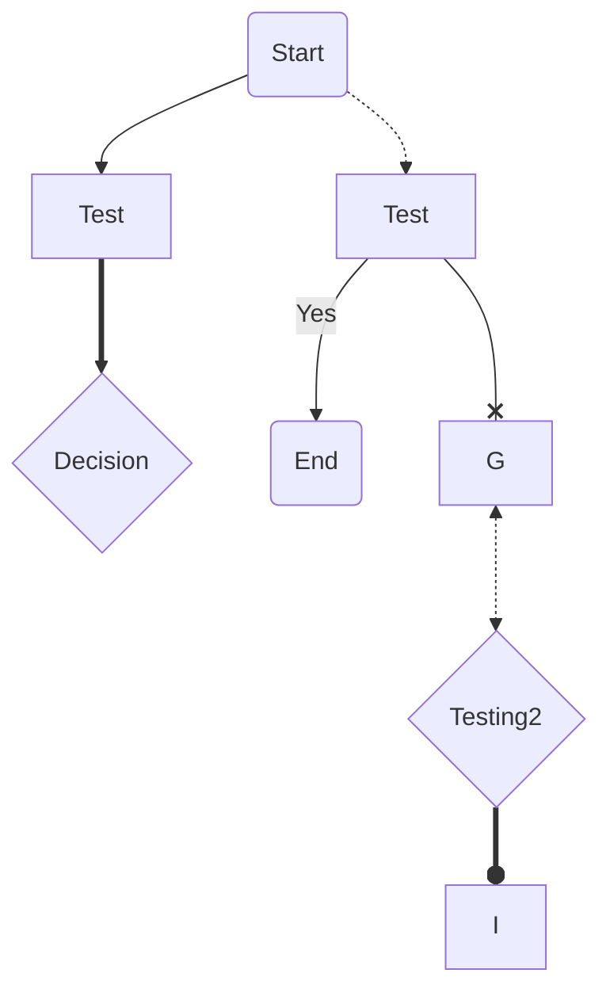
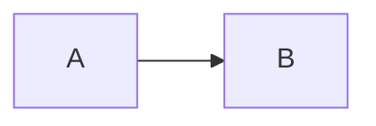
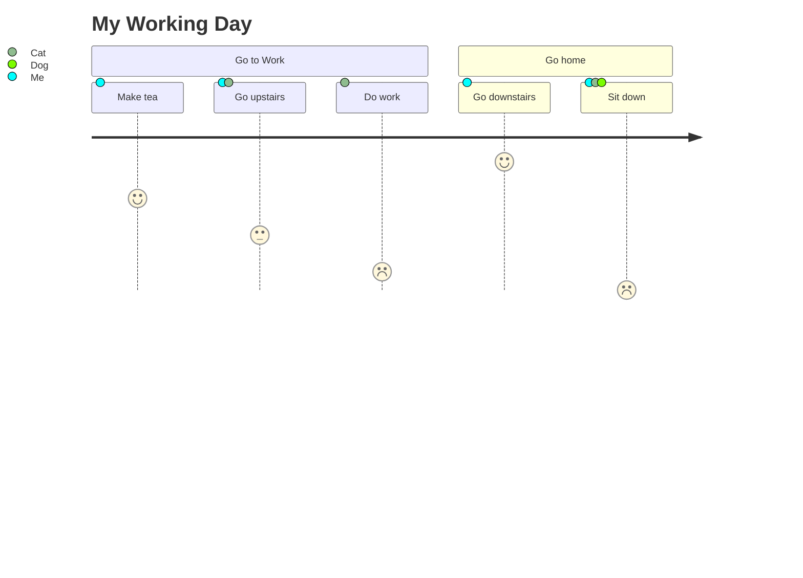
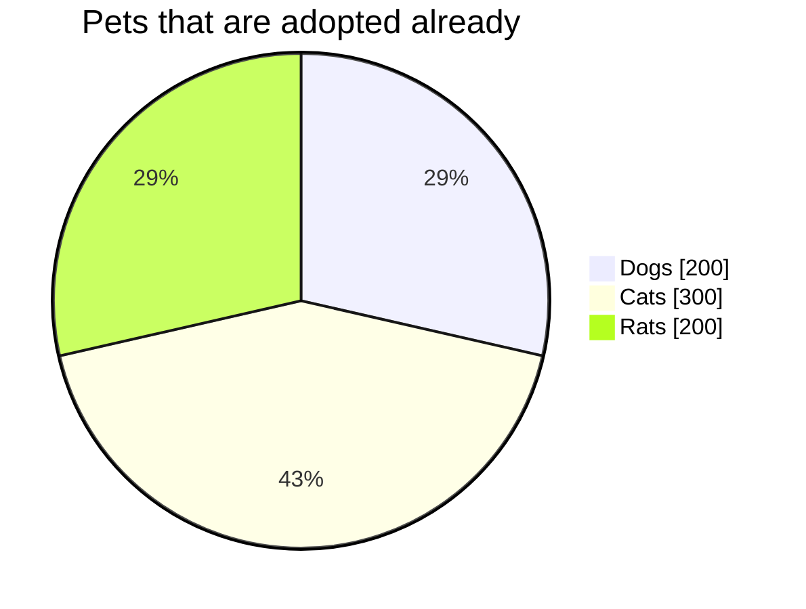
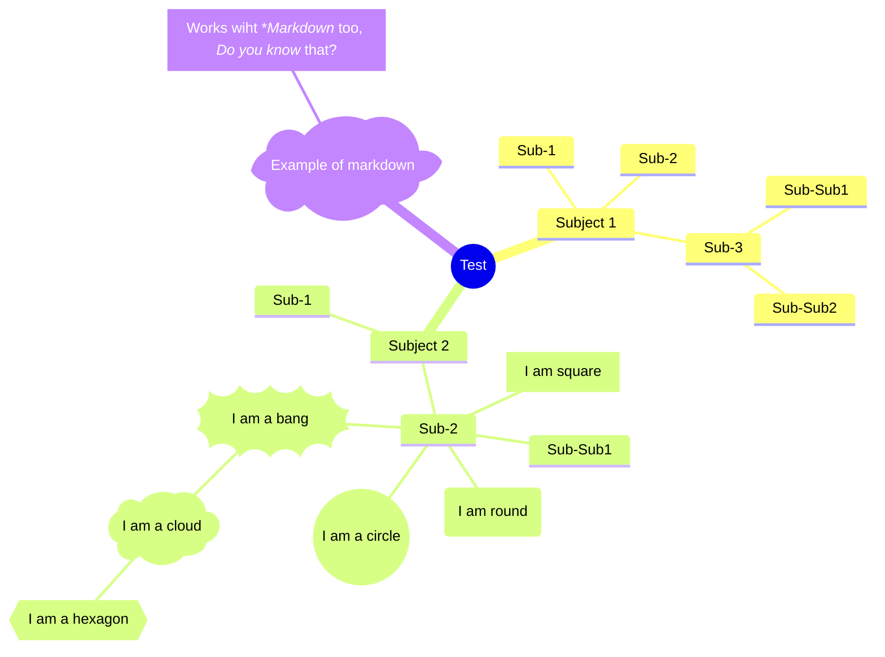
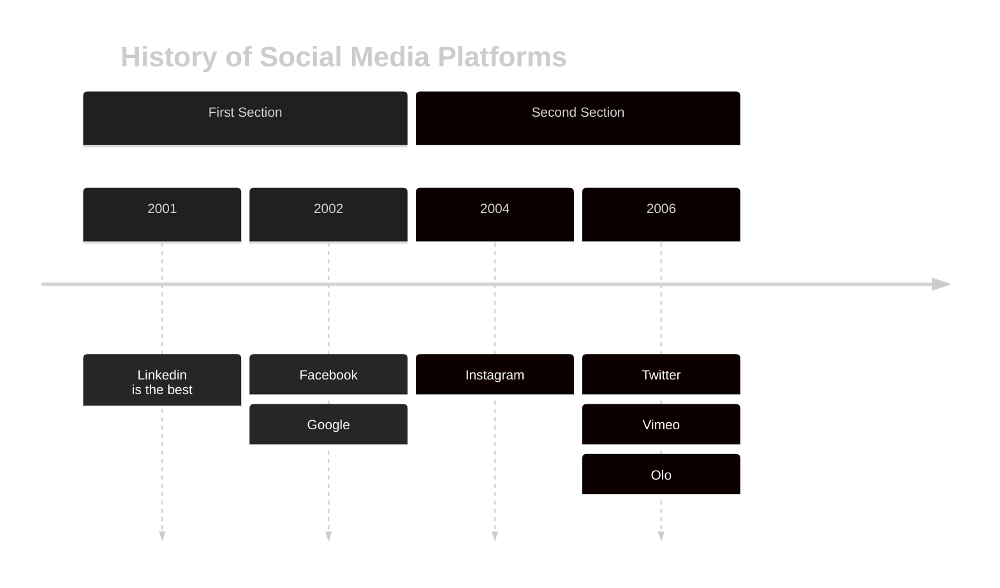
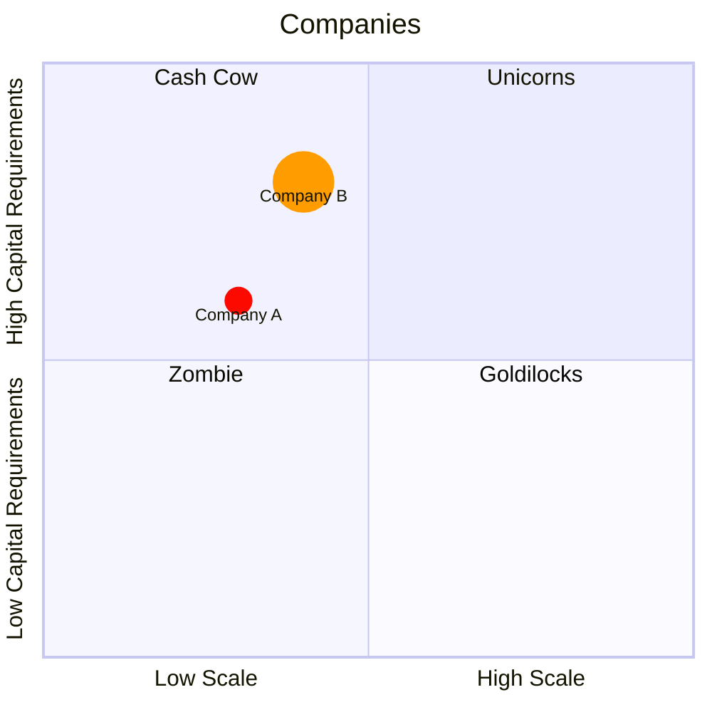
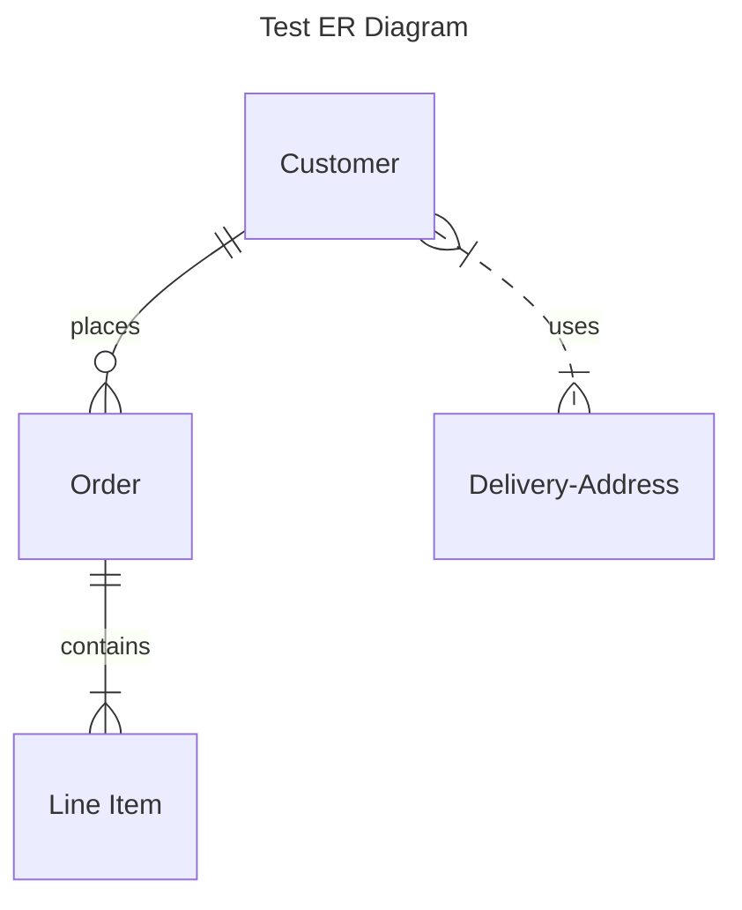
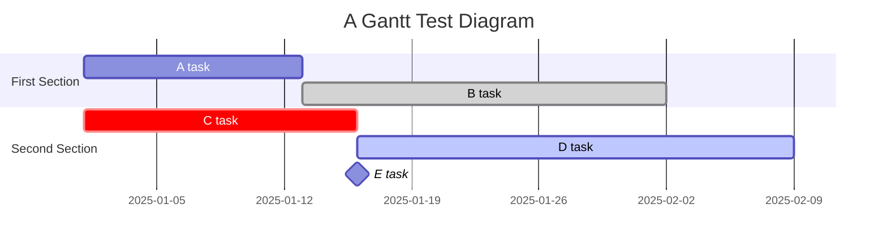

<!-- Mermaid Syntax practice: https://mermaid.js.org/syntax -->
<!-- This is a markdown comment, which is the same as a HTML comment -->

<!--
This is a multi line
comment
-->

<!-- Flowchart -->

<!-- User Journey -->

<!-- Pie Chart -->

<!-- Mindmap -->

<!-- Timeline -->

<!-- Quadrant Chart -->

<!-- Entity Relationship Diagram -->

<!-- 
Relationship Syntax Legend
|o	o|	Zero or one
||	||	Exactly one
}o	o{	Zero or more (no upper limit)
}|	|{	One or more (no upper limit)
--	identifying
..	non-identifying
to	identifying
optionally to	non-identifying

-->

<!-- Gantt -->

<!-- 
Valid Gantt Tags:
    active, done, crit, milestone
-->

<!--
Gantt Syntax
gantt
    dateFormat  YYYY-MM-DD
    title       Adding GANTT diagram functionality to mermaid
    excludes    weekends
    %% (`excludes` accepts specific dates in YYYY-MM-DD format, days of the week ("sunday") or "weekends", but not the word "weekdays".)

    section A section
    Completed task            :done,    des1, 2014-01-06,2014-01-08
    Active task               :active,  des2, 2014-01-09, 3d
    Future task               :         des3, after des2, 5d
    Future task2              :         des4, after des3, 5d

    section Critical tasks
    Completed task in the critical line :crit, done, 2014-01-06,24h
    Implement parser and jison          :crit, done, after des1, 2d
    Create tests for parser             :crit, active, 3d
    Future task in critical line        :crit, 5d
    Create tests for renderer           :2d
    Add to mermaid                      :until isadded
    Functionality added                 :milestone, isadded, 2014-01-25, 0d

    section Documentation
    Describe gantt syntax               :active, a1, after des1, 3d
    Add gantt diagram to demo page      :after a1  , 20h
    Add another diagram to demo page    :doc1, after a1  , 48h

    section Last section
    Describe gantt syntax               :after doc1, 3d
    Add gantt diagram to demo page      :20h
    Add another diagram to demo page    :48h
-->