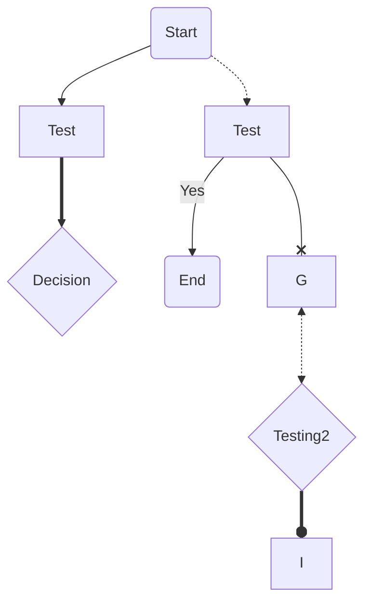
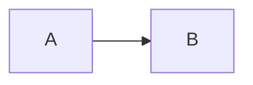
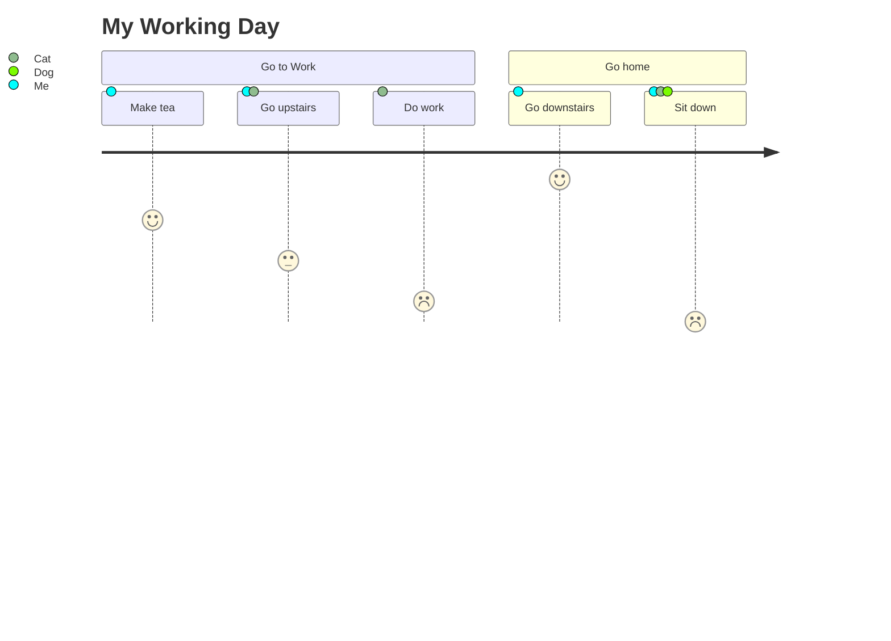
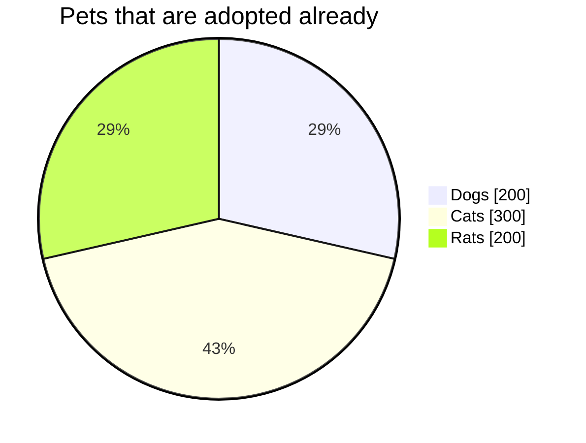
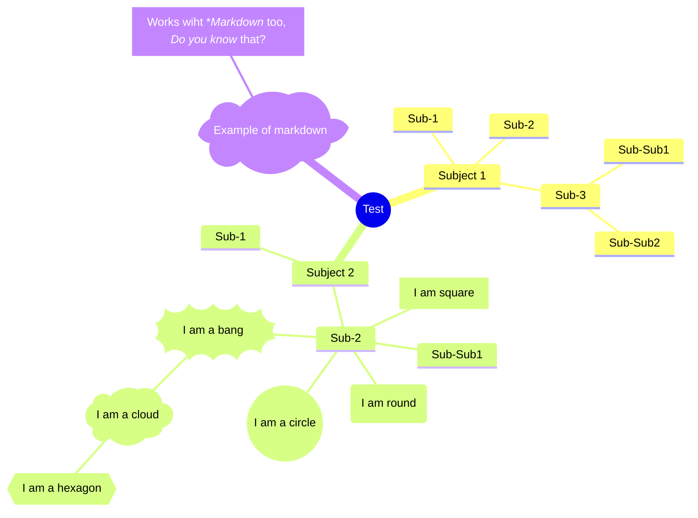
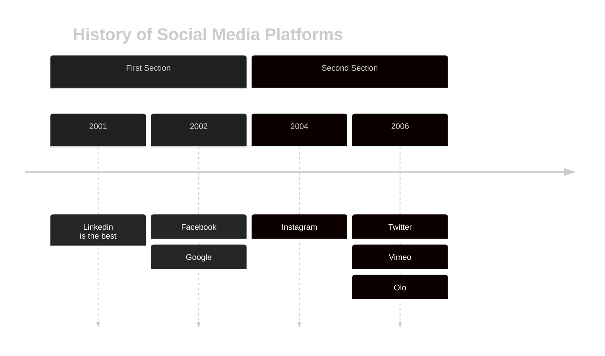
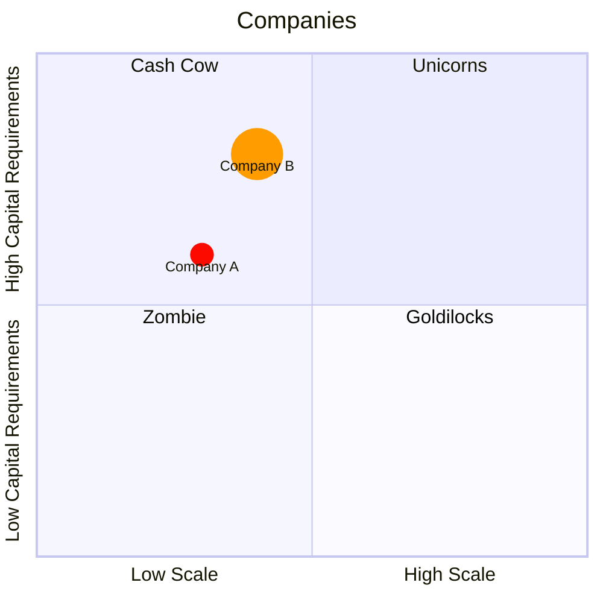
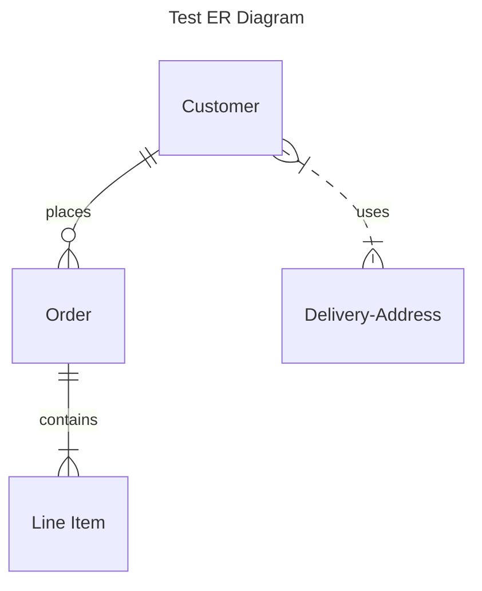

<!-- Mermaid Syntax practice: https://mermaid.js.org/syntax -->
<!-- This is a markdown comment, which is the same as a HTML comment -->

<!--
This is a multi line
comment
-->

<!-- Flowchart -->

<!-- User Journey -->

<!-- Pie Chart -->

<!-- Mindmap -->

<!-- Timeline -->

<!-- Quadrant Chart -->

<!-- Entity Relationship Diagram -->

<!-- 
Relationship Syntax Legend
|o	o|	Zero or one
||	||	Exactly one
}o	o{	Zero or more (no upper limit)
}|	|{	One or more (no upper limit)
--	identifying
..	non-identifying
to	identifying
optionally to	non-identifying

-->

<!-- Gantt -->